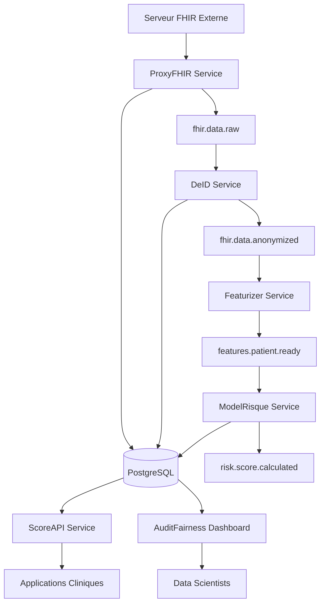

# 🏥 HealthFlow-MS

**Plateforme intelligente d'analyse de risque médical basée sur des microservices**

[](https://docs.docker.com/compose/)
[](https://spring.io/projects/spring-boot)
[](https://www.python.org/)
[](https://www.postgresql.org/)
[](https://kafka.apache.org/)
[](LICENSE)

## � Vue d'ensemble

HealthFlow-MS est une plateforme MLOps complète conçue pour l'analyse de risque médical en temps réel. Elle traite les données FHIR R4, applique des algorithmes d'intelligence artificielle pour prédire les risques de santé, et fournit des explications interprétables pour soutenir les décisions cliniques.

### 🎯 Objectifs principaux

- **Ingestion FHIR** : Traitement standardisé des données médicales
- **Pseudonymisation** : Protection de la vie privée conforme HIPAA/GDPR
- **IA Médicale** : Prédiction de risques avec modèles XGBoost et BioBERT
- **Explicabilité** : Visualisations SHAP pour l'interprétabilité des modèles
- **Monitoring** : Surveillance de la dérive des données et de l'équité des algorithmes

## 🏗️ Architecture du Système

### Architecture Microservices Event-Driven



### 📊 Flux de Données

1. **ProxyFHIR** → Ingestion des données FHIR et publication dans `fhir.data.raw`
2. **DeID** → Consommation, anonymisation et publication dans `fhir.data.anonymized`
3. **Featurizer** → Extraction NLP/stats et publication dans `features.patient.ready`
4. **ModelRisque** → Prédiction ML et stockage en base + publication d'alertes
5. **ScoreAPI** → Exposition REST sécurisée des résultats
6. **AuditFairness** → Monitoring continu de l'équité et dérive

## 🚀 Démarrage Rapide

### Prérequis

- Docker Engine 20.10+
- Docker Compose 2.0+
- 8GB RAM minimum
- 20GB espace disque

### Installation

1. **Cloner le repository**
```bash
git clone https://github.com/your-org/HealthFlow-MS.git
cd HealthFlow-MS
```

2. **Lancer l'environnement complet**
```bash
docker-compose up -d
```

3. **Vérifier le statut des services**
```bash
docker-compose ps
```

4. **Accéder aux interfaces**
- **ScoreAPI Documentation** : http://localhost:8082/docs
- **AuditFairness Dashboard** : http://localhost:8083
- **ProxyFHIR Health** : http://localhost:8081/api/v1/fhir/health

### 🧪 Test du Pipeline Complet

1. **Obtenir un token d'authentification**
```bash
curl -X POST http://localhost:8082/auth/token
```

2. **Ingérer des données FHIR**
```bash
curl -X POST http://localhost:8081/api/v1/fhir/sync/patient/123 \
  -H "Content-Type: application/json"
```

3. **Vérifier le score de risque** (après quelques minutes)
```bash
curl -X GET http://localhost:8082/api/v1/score/PATIENT_XXXXXX \
  -H "Authorization: Bearer YOUR_TOKEN"
```

4. **Accéder aux explications**
```bash
curl -X GET http://localhost:8082/api/v1/explain/PATIENT_XXXXXX \
  -H "Authorization: Bearer YOUR_TOKEN"
```

## 📋 Services Détaillés

### 1. ProxyFHIR (Java/Spring Boot)

**Port** : 8081 | **Responsabilité** : Ingestion FHIR

#### Endpoints Principaux
- `POST /api/v1/fhir/sync/patient/{id}` - Synchroniser un patient
- `POST /api/v1/fhir/sync/patients` - Synchronisation batch
- `GET /api/v1/fhir/health` - Health check

#### Configuration
```properties
# application.properties
fhir.server.base-url=https://hapi.fhir.org/baseR4
spring.datasource.url=jdbc:postgresql://postgres:5432/healthflow
spring.kafka.bootstrap-servers=kafka:9092
```

### 2. DeID (Python)

**Responsabilité** : Anonymisation des données FHIR

#### Fonctionnalités
- Pseudonymisation cohérente avec Faker
- Mapping persistant des identifiants
- Support FHIR R4 complet
- Préservation de la structure des données

#### Variables d'Environnement
```bash
KAFKA_BOOTSTRAP_SERVERS=kafka:9092
POSTGRES_HOST=postgres
DEID_SALT=healthflow-deid-salt-2024
```

### 3. Featurizer (Python/NLP)

**Responsabilité** : Extraction de features médicales

#### Technologies Utilisées
- **BioBERT** : Embeddings contextuels médicaux
- **spaCy sci** : Entités médicales nommées
- **Statistiques** : Agrégation des signes vitaux
- **Features temporelles** : Tendances et évolutions

#### Features Extraites
- Démographiques (âge, genre, statut marital)
- Conditions médicales (comptages par catégorie)
- Médicaments (classes thérapeutiques)
- Signes vitaux (moyennes, tendances, valeurs récentes)
- Entités NLP (symptômes, maladies, traitements)
- Embeddings BioBERT (représentation sémantique)

### 4. ModelRisque (Python/ML)

**Responsabilité** : Prédiction de risque avec explicabilité

#### Modèle ML
- **Algorithme** : XGBoost Classifier
- **Explicabilité** : SHAP TreeExplainer
- **Métriques** : Score de risque (0-1) + niveau de confiance
- **Catégories** : LOW, MODERATE, HIGH, CRITICAL

#### Pipeline de Prédiction
1. Préparation du vecteur de features
2. Normalisation avec StandardScaler
3. Prédiction XGBoost
4. Calcul des valeurs SHAP
5. Génération d'explications textuelles
6. Persistance en base de données

### 5. ScoreAPI (Python/FastAPI)

**Port** : 8082 | **Responsabilité** : API REST sécurisée

#### Sécurité
- **Authentification** : JWT Bearer tokens
- **Autorisation** : Middleware de vérification
- **CORS** : Configuration pour applications web
- **Rate Limiting** : Protection contre les abus

#### Endpoints API

##### Authentification
```bash
POST /auth/token
```
**Réponse** :
```json
{
  "access_token": "eyJ0eXAiOiJKV1QiLCJhbGciOiJIUzI1NiJ9...",
  "token_type": "bearer",
  "expires_in": 1800
}
```

##### Score de Risque
```bash
GET /api/v1/score/{patient_pseudo_id}
Authorization: Bearer {token}
```
**Réponse** :
```json
{
  "patient_pseudo_id": "PATIENT_123456",
  "risk_score": 0.75,
  "prediction_confidence": 0.89,
  "risk_level": "HIGH",
  "model_version": "v1.0",
  "prediction_timestamp": "2024-01-15T10:30:00Z",
  "created_at": "2024-01-15T10:30:05Z"
}
```

##### Explications SHAP
```bash
GET /api/v1/explain/{patient_pseudo_id}
Authorization: Bearer {token}
```
**Réponse** :
```json
{
  "patient_pseudo_id": "PATIENT_123456",
  "risk_score": 0.75,
  "shap_values": {
    "age": 0.12,
    "total_conditions": 0.08,
    "heart_rate_mean": 0.05
  },
  "top_risk_factors": ["age", "total_conditions", "heart_rate_mean"],
  "explanation_text": "Key risk factors: Age increases risk (impact: 0.120); Total Conditions increases risk (impact: 0.080)",
  "model_version": "v1.0",
  "prediction_timestamp": "2024-01-15T10:30:00Z"
}
```

##### Statistiques
```bash
GET /api/v1/statistics/summary
GET /api/v1/scores/recent?limit=50
GET /api/v1/scores/high-risk?threshold=0.7
```

### 6. AuditFairness (Python/Dash)

**Port** : 8083 | **Responsabilité** : Dashboard de monitoring

#### Fonctionnalités de Monitoring

##### Métriques d'Équité
- **Disparate Impact** : Ratio des taux de risque élevé par groupe démographique
- **Equal Opportunity** : Égalité des vrais positifs
- **Demographic Parity** : Distribution équitable des prédictions

##### Détection de Dérive
- **Data Drift** : Évolution des distributions de features
- **Concept Drift** : Changement des relations input-output
- **Population Shift** : Modification des caractéristiques démographiques

##### Visualisations
- Distribution des scores de risque
- Tendances temporelles
- Analyse par groupes démographiques
- Rapports de dérive EvidentlyAI

## 🗄️ Base de Données PostgreSQL

### Schéma Principal

#### Table `fhir_bundles`
```sql
CREATE TABLE fhir_bundles (
    id UUID PRIMARY KEY DEFAULT uuid_generate_v4(),
    patient_id VARCHAR(255) NOT NULL,
    bundle_type VARCHAR(100) NOT NULL DEFAULT 'Patient',
    bundle_data JSONB NOT NULL,
    original_data_hash VARCHAR(64),
    created_at TIMESTAMP WITH TIME ZONE DEFAULT CURRENT_TIMESTAMP
);
```

#### Table `pseudonym_mapping`
```sql
CREATE TABLE pseudonym_mapping (
    id UUID PRIMARY KEY DEFAULT uuid_generate_v4(),
    original_identifier VARCHAR(500) NOT NULL,
    pseudonym_identifier VARCHAR(500) NOT NULL,
    identifier_type VARCHAR(100) NOT NULL,
    salt_used VARCHAR(255),
    created_at TIMESTAMP WITH TIME ZONE DEFAULT CURRENT_TIMESTAMP
);
```

#### Table `prediction_results`
```sql
CREATE TABLE prediction_results (
    id UUID PRIMARY KEY DEFAULT uuid_generate_v4(),
    patient_pseudo_id VARCHAR(255) NOT NULL,
    risk_score DECIMAL(5,4) NOT NULL CHECK (risk_score >= 0.0 AND risk_score <= 1.0),
    prediction_confidence DECIMAL(5,4),
    shap_values_json JSONB,
    feature_vector_json JSONB,
    model_version VARCHAR(50) DEFAULT 'v1.0',
    prediction_timestamp TIMESTAMP WITH TIME ZONE DEFAULT CURRENT_TIMESTAMP
);
```

#### Table `audit_logs`
```sql
CREATE TABLE audit_logs (
    id UUID PRIMARY KEY DEFAULT uuid_generate_v4(),
    service_name VARCHAR(100) NOT NULL,
    operation_type VARCHAR(100) NOT NULL,
    patient_pseudo_id VARCHAR(255),
    operation_metadata JSONB,
    execution_time_ms INTEGER,
    status VARCHAR(50) DEFAULT 'success',
    created_at TIMESTAMP WITH TIME ZONE DEFAULT CURRENT_TIMESTAMP
);
```

## 🔧 Configuration et Personnalisation

### Variables d'Environnement Importantes

#### Sécurité
```bash
JWT_SECRET_KEY=your-super-secret-jwt-key-change-in-production
DEID_SALT=healthflow-deid-salt-2024
```

#### Connexions Base de Données
```bash
POSTGRES_HOST=postgres
POSTGRES_DB=healthflow
POSTGRES_USER=healthflow
POSTGRES_PASSWORD=healthflow123
```

#### Kafka
```bash
KAFKA_BOOTSTRAP_SERVERS=kafka:9092
```

#### Serveur FHIR
```bash
FHIR_SERVER_BASE_URL=https://hapi.fhir.org/baseR4
```

### Personnalisation du Modèle ML

Pour utiliser votre propre modèle :

1. **Entraîner le modèle** avec vos données
2. **Sauvegarder les artifacts** :
   ```python
   # Sauvegarder le modèle XGBoost
   model.save_model('/path/to/model.xgb')
   
   # Sauvegarder l'explainer SHAP
   with open('/path/to/explainer.pkl', 'wb') as f:
       pickle.dump(explainer, f)
   
   # Sauvegarder le scaler
   with open('/path/to/scaler.pkl', 'wb') as f:
       pickle.dump(scaler, f)
   ```

3. **Monter les fichiers** dans le conteneur ModelRisque
4. **Mettre à jour** la configuration du modèle

### Configuration des Features NLP

Pour personnaliser l'extraction de features :

1. **Modifier les concepts médicaux** dans `featurizer/app/main.py`
2. **Ajouter de nouveaux modèles** NLP
3. **Personnaliser les features** démographiques et cliniques

## 📊 Monitoring et Observabilité

### Métriques Disponibles

#### Métriques Métier
- Nombre de prédictions par jour
- Distribution des scores de risque
- Taux de patients à haut risque
- Temps de traitement par patient

#### Métriques Techniques
- Latence des APIs
- Throughput Kafka
- Utilisation CPU/Mémoire
- Erreurs par service

#### Métriques de Qualité ML
- Dérive des données d'entrée
- Stabilité des prédictions
- Métriques d'équité
- Confidence des prédictions

### Alerting

Le système génère des alertes pour :
- Patients à risque critique (score > 0.8)
- Dérive de données détectée
- Biais démographiques identifiés
- Erreurs système critiques

## 🔒 Sécurité et Conformité

### Anonymisation des Données

- **Pseudonymisation** : Remplacement cohérent des identifiants
- **Suppression** : Élimination des adresses et contacts
- **Hachage** : Protection cryptographique des mappings
- **Audit Trail** : Traçabilité complète des transformations

### Conformité RGPD/HIPAA

- **Privacy by Design** : Anonymisation dès l'ingestion
- **Data Minimization** : Collecte uniquement des données nécessaires
- **Right to be Forgotten** : Capacité de suppression
- **Access Control** : Authentification et autorisation

### Sécurité API

- **JWT Authentication** : Tokens signés et expirables
- **HTTPS Only** : Chiffrement en transit
- **Rate Limiting** : Protection contre les abus
- **Input Validation** : Validation stricte des entrées

## 🧪 Tests et Validation

### Tests Fonctionnels

```bash
# Test du pipeline complet
./scripts/test_pipeline.sh

# Test des APIs
./scripts/test_apis.sh

# Test de charge
./scripts/load_test.sh
```

### Validation du Modèle

```bash
# Métriques de performance
./scripts/validate_model.sh

# Tests d'équité
./scripts/fairness_test.sh

# Tests de robustesse
./scripts/robustness_test.sh
```

## 🔧 Dépannage

### Problèmes Courants

#### Services qui ne démarrent pas
```bash
# Vérifier les logs
docker-compose logs [service-name]

# Redémarrer un service
docker-compose restart [service-name]

# Reconstruire les images
docker-compose build [service-name]
```

#### Problèmes de connectivité Kafka
```bash
# Vérifier les topics
docker-compose exec kafka kafka-topics --bootstrap-server localhost:9092 --list

# Vérifier les consumers
docker-compose exec kafka kafka-consumer-groups --bootstrap-server localhost:9092 --list
```

#### Problèmes de base de données
```bash
# Connexion à PostgreSQL
docker-compose exec postgres psql -U healthflow -d healthflow

# Vérifier les tables
\dt

# Vérifier les données
SELECT COUNT(*) FROM prediction_results;
```

### Logs et Debugging

Les logs sont disponibles via :
```bash
# Logs en temps réel
docker-compose logs -f

# Logs d'un service spécifique
docker-compose logs -f proxyfhir

# Logs avec timestamp
docker-compose logs -t
```

## 📈 Performance et Scalabilité

### Optimisations Recommandées

#### Production Ready
1. **Load Balancer** : HAProxy ou NGINX
2. **Database Cluster** : PostgreSQL HA
3. **Kafka Cluster** : Multi-broker setup
4. **Monitoring** : Prometheus + Grafana
5. **Logging** : ELK Stack

#### Scaling Horizontal
```yaml
# docker-compose.override.yml
version: '3.8'
services:
  featurizer:
    scale: 3
  modelrisque:
    scale: 2
  scoreapi:
    scale: 3
```

#### Optimisations Kafka
- Partitioning par patient_id
- Compression des messages
- Batch processing
- Consumer groups dédiés

## 🤝 Contribution

### Structure du Projet

```
HealthFlow-MS/
├── docker-compose.yml          # Infrastructure complète
├── init-db/
│   └── init.sql               # Schémas PostgreSQL
├── proxyfhir/                 # Service Java/Spring Boot
│   ├── src/main/java/         # Code source Java
│   ├── pom.xml               # Dépendances Maven
│   └── Dockerfile            # Image Docker
├── deid/                     # Service Python d'anonymisation
│   ├── app/main.py          # Logic principale
│   ├── requirements.txt     # Dépendances Python
│   └── Dockerfile           # Image Docker
├── featurizer/              # Service d'extraction NLP
│   ├── app/main.py         # Extraction de features
│   ├── requirements.txt    # Dépendances ML/NLP
│   └── Dockerfile          # Image Docker
├── modelrisque/            # Service de prédiction ML
│   ├── app/main.py        # Modèle XGBoost + SHAP
│   ├── model/             # Artifacts du modèle
│   ├── requirements.txt   # Dépendances ML
│   └── Dockerfile         # Image Docker
├── scoreapi/              # API REST FastAPI
│   ├── app/main.py       # Endpoints sécurisés
│   ├── requirements.txt  # Dépendances API
│   └── Dockerfile        # Image Docker
├── auditfairness/        # Dashboard Dash
│   ├── app/dashboard.py  # Interface de monitoring
│   ├── requirements.txt  # Dépendances dashboard
│   └── Dockerfile        # Image Docker
└── README.md             # Documentation complète
```

### Guidelines de Développement

1. **Code Quality** : Tests unitaires obligatoires
2. **Documentation** : Docstrings et commentaires
3. **Security** : Scan des vulnérabilités
4. **Performance** : Profiling des services critiques

## 📄 Licence

Ce projet est sous licence MIT. Voir le fichier [LICENSE](LICENSE) pour plus de détails.

## 🙋‍♂️ Support

### Documentation Supplémentaire
- [Architecture Decision Records](docs/adr/)
- [API Documentation](docs/api/)
- [Deployment Guide](docs/deployment/)
- [Troubleshooting Guide](docs/troubleshooting/)

### Contacts
- **Équipe Technique** : tech-team@healthflow.com
- **Support** : support@healthflow.com
- **Sécurité** : security@healthflow.com

---

**HealthFlow-MS** - *Transforming Healthcare through Intelligent Risk Assessment*